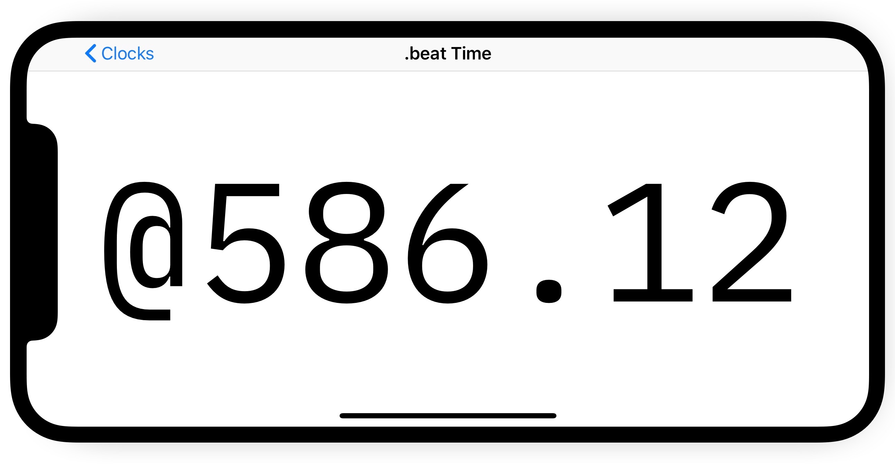

# Tiime

<p align="center">
	<a href="./meta/screenshots/2018-05-31-tiime-beat-time-view-landscape-bordered.jpg">
		
	</a><br />
	<caption><em>Landscape view of .beat time as of 2018-05-31</em></caption>
</p>

Tiime is two things:

1. A clock that tells time in unconventional ways.
2. An app I'll be developing to learn about iOS development.

<small>[Click here for more screenshots](./meta/screenshots/)</small>

## About

The idea for Tiime came after listening to an episode of the late <cite>TLDR</cite> podcast (hosted by <cite>Reply All's</cite> [PJ Vogt](https://twitter.com/PJVogt) and [Alex Goldman](https://twitter.com/agoldmund)) titled [<cite>Internet Time</cite>](https://www.wnyc.org/story/15-internet-time/). In it, PJ talks about Swatch's 1998 attempt to reinvent our concept of time by inventing [Internet Time (or _.beat time_)](https://en.wikipedia.org/wiki/Swatch_Internet_Time). In _.beat time_, the day is divided into 1000 "beats" of equal length (1 beat = 86.4 seconds). The experiment ultimately has fallen by the wayside, but there are still a scant few people in the world that use — or at least appreciate — the concept.

I decided it would be an interesting experiment to try to make a clock that told time in beats. As this is a simple enough idea, I also realized that it would be a great way to easily and quickly learn about iOS development as a whole. I plan to bring the app to as many platforms as possible (iOS, watchOS, tvOS, macOS), use as many features and niceties as I can (iOS and macOS Today extensions, Apple Watch complication, CarPlay, macOS screen saver, etc.), and try out various iOS development tools ([AppCode](https://www.jetbrains.com/objc/), [fastlane](https://fastlane.tools), [TestFlight](https://developer.apple.com/testflight/), app localization & translation, [RxSwift](https://github.com/ReactiveX/RxSwift/), [ReSwift](https://github.com/ReSwift/ReSwift), [Carthage](https://github.com/Carthage/Carthage), etc.).

## Time Types

### Currently Implemented

- .beat time (a.k.a. Internet Time)
- Device Time
- Unix Time

### Implementation Planned

- Decimal Time
- [New Earth Time (a.k.a NET)](https://en.wikipedia.org/wiki/New_Earth_Time) (h/t @eli-oat)

## Participate

### Test

Would you like to beta test the app? Send me an email at [tiime@level.software](mailto:tiime@level.software), and I'll get you added to the list!

### Development

I'm developing the app in the open because I believe in Open Source, and it would be fun if others wanted to collaborate on the project. I'm new to iOS development, so I am _very_ open to any suggestions you might have. I'd especially love recommendations on how to architect the project. I'd like to make it as modular as reasonably possible.

#### Bootstrapping Instructions

I'm using [Carthage](https://github.com/Carthage/Carthage) for dependency management. So make sure you've installed Carthage on your computer before continuing.

Once you've cloned the repo, in your terminal, from the root directory of the project, run the following command:

```bash
carthage update --platform iOS
```

This will download and build all the necessary dependencies (it may take a while). Once that's done, you should be able to build and run the app from within Xcode/AppCode.

## Acknowledgements

- [<cite>Internet Time</cite>](https://www.wnyc.org/story/15-internet-time/) - The TLDR episode that planted the initial idea in my brain.
- [<cite>NetTime</cite>](https://github.com/simonrice/nettime) - An iOS beat time clock app by [Simon Rice](http://simonrice.com) that he has graciously made open source. Looking at his code has made the initial steps of getting the project up and running much easier.
- [<cite>Geek Clock Tool</cite>](http://spwebgames.com/clockinfo/) - A web app (and [Android app](http://spwebgames.com/clockinfo/android.php)) by [Steve Pugh](http://stevepugh.co.uk) that displays the current time in eight different ways! I'm hoping to implement some of these other methods into Tiime someday.

## Resources

All of the resources I used when building Tiime:

- [<cite>UIKit init Patterns</cite>](https://theswiftdev.com/2017/10/11/uikit-init-patterns/) - Explains some good practices to use when initializing a UIViewController or UIView from code. I found that overriding the init methods isn't quite as easy as I expected, mainly because UIKit elements can be initialized from code, or from Interface Builder, and there are built-in initializer methods you have to use/override in order to also implement a custom one.
