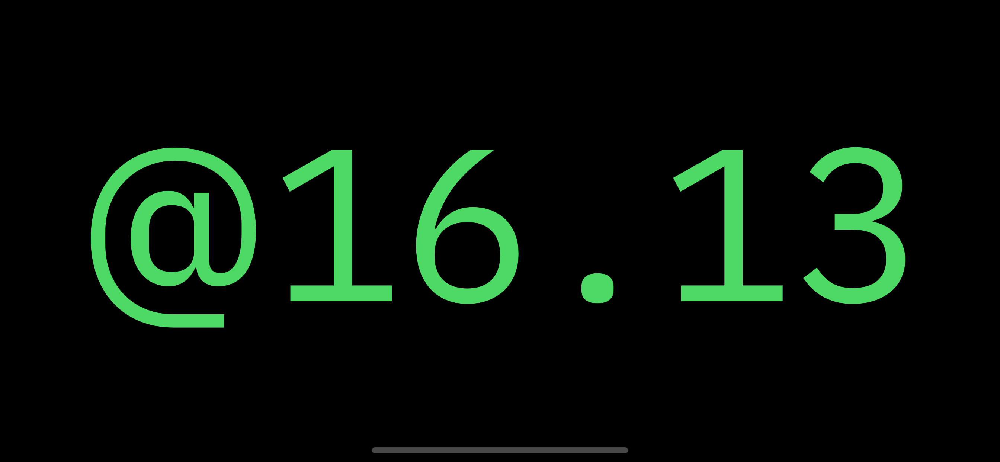

# Tiime

<figure align="center">
	<a href="./assets/app-icon/06 - afternoon/afternoon-83.5@2x.png">
		
	</a>
	<figcaption>
		Tiime's app icon, designed by <a href="https://twitter.com/beautyislikeyea">Ryan Lower</a>
	</figcaption>
</figure>

Tiime is two things:

1. A clock that tells time in unconventional ways
2. An app I developed to learn more about iOS development

## About Tiime

The idea for Tiime came after listening to an episode of the late <cite>TLDR</cite> podcast (hosted by <cite>Reply All's</cite> [PJ Vogt](https://twitter.com/PJVogt) and [Alex Goldman](https://twitter.com/agoldmund)) titled [<cite>Internet Time</cite>](https://www.wnyc.org/story/15-internet-time/). In it, PJ talks about Swatch's 1998 attempt to reinvent our concept of time by inventing [Internet Time (or _.beat time_)](https://en.wikipedia.org/wiki/Swatch_Internet_Time). In _.beat time_, the day is divided into 1000 "beats" of equal length (1 beat = 86.4 seconds). The experiment ultimately has fallen by the wayside, but there are still a scant few people in the world that use — or at least appreciate — the concept.

I decided it would be an interesting experiment to try to make a clock that told time in beats. As this is a simple enough idea, I also realized that it would be a great way to easily and quickly learn about iOS development as a whole. I plan to bring the app to as many platforms as possible (iOS, watchOS, tvOS, macOS), use as many features and niceties as I can (iOS and macOS Today extensions, Apple Watch complication, CarPlay, macOS screen saver, etc.), and try out various iOS development tools ([AppCode](https://www.jetbrains.com/objc/), [fastlane](https://fastlane.tools), [TestFlight](https://developer.apple.com/testflight/), app localization & translation, [RxSwift](https://github.com/ReactiveX/RxSwift/), [ReSwift](https://github.com/ReSwift/ReSwift), [Carthage](https://github.com/Carthage/Carthage), etc.).

<figure align="center">
	<a href="./assets/screenshots/1.0.0/iPhone/6.5-inch/06-clock-fullscreen.png">
		
	</a>
	<figcaption>
		Landscape view of .beat time in version 1.0.0<br />
		<small><a href="./assets/screenshots/">Click here for more screenshots</a></small>
	</figcaption>
</figure>

### Architecture

I've architected the app using the Coordinator pattern, originally conceived of by Soroush Khanlou in a blog post titled [<cite>The Coordinator</cite>](http://khanlou.com/2015/01/the-coordinator/). He wrote a followup titled [<cite>Coordinators Redux</cite>](http://khanlou.com/2015/10/coordinators-redux/) which is also a great read. Since Khanlou's initial idea, the topic has been written about extensively, so it shouldn't be difficult to find information on it online.

Essentially, the flow of the application is handled by a "Coordinator", a special type of class whose purpose is to coordinate movement and communication between view controllers. Tiime's coordinators are relatively simple (as the app itself is relatively simple). There is an `ApplicationCoordinator` that coordinates things at the highest level, and then a `ClockListCooordinator` and a `SettingsListCoordinator` below that. Most of the interesting bits are in the `ApplicationCoordinator`.

### UI Design

I tried to follow Apple's general design guidelines throughout the app, and rely on native APIs where I could. I also chose to do all UI work in code rather than through Storbyoards, both as a way to challenge myself, and to learn about interacting with UIKit through code.

At the highest level there is a `UISplitViewController` which handles switching between the primary and secondary views on compact width devices (most iPhones), and displaying both the primary and secondary views at once on normal width devices (all iPads, and some iPhones when in landscape mode).

## Time Types

### Currently Implemented

- [.beat time (a.k.a. Internet Time)](https://en.wikipedia.org/wiki/Swatch_Internet_Time)
- [Unix Time](https://en.wikipedia.org/wiki/Unix_time)
- [Metric Time](https://en.wikipedia.org/wiki/Metric_time)
- Device Time (The device's default clock)

### Planned Implementation

- [Dozenal / Duodecimal](https://en.wikipedia.org/wiki/Duodecimal)
- [Hex / Hexadecimal](https://en.wikipedia.org/wiki/Hexadecimal_time)
- [Binary](https://en.wikipedia.org/wiki/Binary_clock)
- Chinese
- [New Earth Time (a.k.a NET)](https://en.wikipedia.org/wiki/New_Earth_Time) (h/t [@eli-oat](https://github.com/eli-oat/))

Web based implementations of most of these can be found online at the [Geek Clock Tool](http://spwebgames.com/clockinfo/)

## Participate

### Beta Test

Would you like to beta test the app? Send me an email at [tiime@level.software](mailto:tiime@level.software), and I'll get you added to the list!

### Development

I'm developing the app in the open because I believe in Open Source, and it would be fun if others wanted to collaborate on the project. I'm new to iOS development, so I am _very_ open to any suggestions you might have. I'd especially love recommendations on how to architect the project. I'd like to make it as modular as reasonably possible.

#### Bootstrapping Instructions

The project's only external dependencies are its fonts, which are setup as git submodules. To clone the project and also the submodules, include the `--recurse-submodules` flag in your `git clone` command. Like so:

```shell
git clone --recurse-submodules https://github.com/hisaac/Tiime.git
```

Then, to update the submodules in the future, use the following command:

```shell
git submodule update --recursive
```

Alternately, you can add the following entry to your `.gitconfig` so that doing a `git pull` will also update any submodules in the project:

```plain
[submodule]
	recurse = true
```

## Thanks

- [Ryan Lower](https://twitter.com/beautyislikeyea) designed the app's beautiful icons.
- [Eli Mellen](https://eli.li/) ([@eli-oat](https://github.com/eli-oat/)) was wicked helpful with QA and general app feedback.
	- Eli even built a [web version of Tiime](https://tiime.eli.li) in JavaScript! Check out the code here: <https://github.com/eli-oat/tiime-web>
- [Katie Holmes](https://krholmes.com) gave me some valuable UX feedback, and helped me with some Adobe Illustrator and Sketch questions.

## Acknowledgements/Resources

- Countless [StackOverflow](https://stackoverflow.com) posts.
- [<cite>Internet Time</cite>](https://www.wnyc.org/story/15-internet-time/) - The TLDR episode that planted the initial idea in my brain.
- [<cite>NetTime</cite>](https://github.com/simonrice/nettime) - An iOS beat time clock app by [Simon Rice](http://simonrice.com) that he has graciously made open source. Looking at his code has made the initial steps of getting the project up and running much easier.
- [<cite>Geek Clock Tool</cite>](http://spwebgames.com/clockinfo/) - A web app (and [Android app](http://spwebgames.com/clockinfo/android.php)) by [Steve Pugh](http://stevepugh.co.uk) that displays the current time in eight different ways! I'm hoping to implement some of these other methods into Tiime someday.
- [<cite>Metric Time</cite>](https://zapatopi.net/metrictime/) - A great explainer of Metric time by [Lyle Zapato](https://zapatopi.net/).
- [<cite>UIKit init Patterns</cite>](https://theswiftdev.com/2017/10/11/uikit-init-patterns/) - Explains some good practices to use when initializing a UIViewController or UIView from code. I found that overriding the init methods isn't quite as easy as I expected, mainly because UIKit elements can be initialized from code, or from Interface Builder, and there are built-in initializer methods you have to use/override in order to also implement a custom one.
